# Staffing Solutions by Sarah - Website Architecture + Visual Direction + Mermaid Build Guide

## Purpose
This file combines the two saved project inputs into one reusable build brief:
1. Site architecture / SEO north star
2. Visual direction / image strategy
3. Merged Mermaid flowchart
4. AI instructions for designers, developers, and copywriters

---

# 1. PROJECT NORTH STAR

## Agency Identity
A multi-sector, Ontario-wide Workforce Solutions provider.

## Core Objective
Pivot from niche specialist to industry-agnostic authority without losing legacy SEO value.

## SEO Target
Rank for high-intent hiring keywords across Ontario local markets from GTA to Windsor.

## Core Site Logic
- Home = router
- Hire Talent = client hub
- Find Work = candidate hub
- Specializations = industry hub
- Locations = regional hub
- Background assets = Blog / Insights, Newsletter / Market Reports, Case Studies / Multi-Sector Proof

## Industry Hub Examples
- Manufacturing & Skilled Trades
- Food, Grocery & Retail
- Finance & Accounting
- IT & Technology
- Sales & Marketing
- Administrative & Support

## Location Hub Examples
- Vaughan
- Toronto / GTA
- Belleville
- Windsor
- Chatham-Kent

## Technical / SEO Rules
- Every industry and location should have its own unique URL.
- Use breadcrumb logic: Home > Specializations > [Industry]
- Bridge tagline: Scaling Ontario’s Workforce
- Employer CTAs:
  - Request Talent Profile
  - Book Strategy Call
- Candidate CTAs:
  - Submit Resume
  - Browse Jobs
- Blog / Insights should act as the SEO engine and internally link back to industry and location pages.

## Newsletter / Lead Magnet Strategy
- Placement: sitewide footer plus mid-page trigger on industry pages
- Hook: The Ontario Labor Market Report: Monthly insights on hiring trends in [Industry]
- Each industry page should support sector-specific lead capture tied to salary expectations

## Brand Voice
- Authoritative
- High-energy
- Professional
- Resourceful
- Strategic Talent Partner, not just recruiter
- Clean, modern, corporate-industrial aesthetic

---

# 2. VISUAL DIRECTION REFERENCE

## Hero - Homepage
**Vibe**
- High-energy
- Movement
- Scale

**Image Direction**
- Environmental montage
- Handshake overlaying a blurred background of a clean modern warehouse or bright corporate office

**Goal**
- Prove the agency is the bridge between people and business

## Specializations Preview / Industry Grid
Use contextual action shots, not generic stock clichés.

### Manufacturing / Trades
- Worker using a tablet or digital caliper
- Signals technology + skill

### Food & Grocery
- Fast-paced clean commercial kitchen
- Modern high-end grocery aisle with manager in blazer

### Finance & IT
- Bright collaborative glass office
- Or high-end laptop with data charts
- Avoid dated blue-code backgrounds

### Sales & Marketing
- Person presenting at a whiteboard
- Or a high-energy win moment in a boardroom

## Hire Talent Page
**Image Direction**
- Consultant look
- Professional woman sitting across from an executive reviewing a strategy map

**Goal**
- Position the agency as a partner, not just a resume-sender

## Find Work Page
**Image Direction**
- Future self
- Diverse people in their real work environments looking confident and happy
- Include supervisors or department leads where relevant

**Goal**
- Help candidates picture their next career step

## Location Pages
Use real local landmarks, not generic skylines.

### Vaughan
- VMC glass buildings

### Windsor
- Ambassador Bridge or waterfront

### Belleville
- Front Street vibe or Bay of Quinte

**Goal**
- Instant local trust and geographic credibility

## Process Section
**Image Direction**
- Blueprint flat-lay
- Minimalist notebook, coffee cup, and pen

**Goal**
- Show organization, method, and calm

## About Sarah
**Image Direction**
- Authentic environmental portrait
- High-end professional headshot in a bright office or leaning against a desk
- Not a flat studio backdrop

**Goal**
- Support E-E-A-T, expertise, and trust

## Invisible Blog / Newsletter
**Image Direction**
- Data and knowledge
- Hands holding a tablet with a market report chart
- Or a newspaper-style aesthetic

## Image SEO Rule
- Name image files with keywords before upload
- Example: grocery-staffing-vaughan-ontario.jpg
- Treat Google Images as a secondary traffic source

---

# 3. MERGED MERMAID FLOWCHART

Paste this into Mermaid Live Editor or any Mermaid-compatible builder.

```mermaid
flowchart TD

    A["Home / Router
    Main entry point
    Scroll-snap homepage
    CTA: Request Talent Profile | Book Strategy Call | Submit Resume | Browse Jobs
    Visual: Handshake overlay + blurred warehouse / office montage"]:::home

    A --> H1["Hero Preview
    Goal: bridge people and business
    Visual: environmental montage
    CTA: I'm Hiring | I'm Looking"]:::section

    A --> H2["Trust / Credibility Strip
    Goal: trust, proof, authority"]:::section

    A --> H3["About Preview
    Routes to About
    Goal: trust + agency story"]:::section

    A --> H4["Hire Talent Preview
    Routes to Hire Talent
    CTA: Request Talent Profile | Book Strategy Call"]:::section

    A --> H5["Find Work Preview
    Routes to Find Work
    CTA: Submit Resume | Browse Jobs"]:::section

    A --> H6["Specializations Preview
    Routes to Industry Hub + industry pages
    Visual: contextual action shots by sector"]:::section

    A --> H7["Locations Preview
    Routes to regional pages
    Goal: local trust"]:::section

    A --> H8["Process Preview
    Routes to Our Process
    Visual: notebook + coffee + pen flat-lay"]:::section

    A --> H9["Testimonials / Proof
    Goal: social proof + conversion"]:::section

    A --> H10["Final CTA
    Request Talent Profile | Book Strategy Call | Submit Resume | Browse Jobs"]:::cta

    B["Hire Talent / Client Hub
    Employer-facing conversion page
    CTA: Request Talent Profile | Book Strategy Call
    Visual: consultant across from executive reviewing strategy map"]:::page

    C["Find Work / Candidate Hub
    Candidate-facing conversion page
    CTA: Submit Resume | Browse Jobs
    Visual: confident professionals in real work environments"]:::page

    D["Specializations / Industry Hub
    Industry authority page
    Goal: sector coverage + SEO silo"]:::page

    E["Locations / Regional Hub
    Ontario market coverage
    Goal: local search visibility + trust"]:::page

    P["Our Process
    Intake → Source → Vet → Success
    Visual: blueprint flat-lay"]:::page

    AB["About Sarah / About
    Agency story + E-E-A-T
    Visual: environmental portrait in bright office"]:::page

    CT["Contact
    General inquiry page"]:::page

    BC["Book Strategy Call
    Scheduling conversion page"]:::cta

    J["Jobs
    Browse open roles"]:::page

    RS["Submit Resume
    Candidate intake action"]:::cta

    D --> D1["Manufacturing & Skilled Trades
    Visual: worker using tablet or digital caliper"]:::subpage
    D --> D2["Food, Grocery & Retail
    Visual: clean commercial kitchen or premium grocery aisle"]:::subpage
    D --> D3["Finance & Accounting
    Visual: bright office or laptop with charts"]:::subpage
    D --> D4["IT & Technology
    Visual: collaborative glass office or data-focused workspace"]:::subpage
    D --> D5["Sales & Marketing
    Visual: whiteboard presentation or boardroom win moment"]:::subpage
    D --> D6["Administrative & Support
    Visual: polished office support environment"]:::subpage

    E --> E1["Vaughan
    Visual: VMC glass buildings"]:::subpage
    E --> E2["Toronto / GTA
    Visual: polished urban business environment"]:::subpage
    E --> E3["Belleville
    Visual: Front Street vibe or Bay of Quinte"]:::subpage
    E --> E4["Windsor
    Visual: Ambassador Bridge or waterfront"]:::subpage
    E --> E5["Chatham-Kent
    Visual: local industrial / regional business setting"]:::subpage

    F["Background Assets / SEO Engine"]:::support
    F --> F1["Insights / Blog
    Must internally link to industry + location pages"]:::support
    F --> F2["Newsletter / Ontario Labor Market Report
    Lead magnet by sector"]:::support
    F --> F3["Case Studies / Multi-Sector Proof"]:::support

    A --> B
    A --> C
    A --> D
    A --> E
    A --> P
    A --> AB
    A --> CT

    B --> BC
    B --> CT

    C --> RS
    C --> J
    C --> CT

    D1 --> BC
    D1 --> RS
    D2 --> BC
    D2 --> RS
    D3 --> BC
    D3 --> RS
    D4 --> BC
    D4 --> RS
    D5 --> BC
    D5 --> RS
    D6 --> BC
    D6 --> RS

    E1 --> B
    E1 --> C
    E2 --> B
    E2 --> C
    E3 --> B
    E3 --> C
    E4 --> B
    E4 --> C
    E5 --> B
    E5 --> C

    F1 --> D
    F1 --> E
    F2 --> D
    F3 --> B

    SU1["Book Strategy Call Success
    Hidden conversion page"]:::support
    SU2["Resume Submission Success
    Hidden conversion page"]:::support
    SU3["Contact Success
    Hidden conversion page"]:::support

    BC --> SU1
    RS --> SU2
    CT --> SU3

    L1["Privacy Policy"]:::legal
    L2["Terms of Use"]:::legal
    L3["Recruitment Disclaimer"]:::legal

    A --> L1
    A --> L2
    A --> L3

    classDef home fill:#111,color:#fff,stroke:#111,stroke-width:2px;
    classDef page fill:#f5f5f5,color:#111,stroke:#999,stroke-width:1.5px;
    classDef subpage fill:#ffffff,color:#111,stroke:#bbb,stroke-width:1px;
    classDef section fill:#fafafa,color:#111,stroke:#ccc,stroke-dasharray: 4 2;
    classDef cta fill:#e8f0ea,color:#111,stroke:#6b8f71,stroke-width:2px;
    classDef support fill:#f3f0ff,color:#111,stroke:#9a8fd1,stroke-width:1px;
    classDef legal fill:#fff7e6,color:#111,stroke:#d6a84f,stroke-width:1px;
```

---

# 4. AI BUILD INSTRUCTIONS

## For a Web Designer
Use this file to:
- establish main navigation
- map homepage scroll-snap sections as previews, not full pages
- keep Home as the router
- separate conversion hubs from SEO hubs
- build a clean, premium, modern layout
- preserve clear CTA hierarchy for employer and candidate flows

## For a Copywriter
Use this file to:
- define H1 structure around industry and location intent
- keep employer and candidate messaging separate
- write homepage previews as short teaser sections
- write full pages with stronger detail and proof
- maintain the voice: authoritative, high-energy, professional, resourceful

## For a Developer
Use this file to:
- create unique URLs for each industry and location
- implement breadcrumb logic
- keep legal pages in footer / utility structure
- create success pages for resume, booking, and contact submissions
- support blog-to-industry and blog-to-location internal links
- preserve CTA routing:
  - Employer: Request Talent Profile / Book Strategy Call
  - Candidate: Submit Resume / Browse Jobs

## For an AI Builder
Use this file as the source of truth for:
- site architecture
- page hierarchy
- user flows
- conversion paths
- page-level visual direction
- image style rules
- internal SEO linking logic

Do not collapse industry pages into one page.
Do not collapse location pages into one page.
Do not turn homepage sections into full long-form pages.
Homepage sections should act as preview panels that route into full pages.

---

# 5. QUICK BUILD CHECKLIST

## Homepage
- Scroll-snap router
- Hero with dual-path CTA
- Trust strip
- About preview
- Hire Talent preview
- Find Work preview
- Specializations preview
- Locations preview
- Process preview
- Testimonials / proof
- Final CTA

## Main Pages
- Hire Talent
- Find Work
- Specializations
- Locations
- About
- Contact
- Our Process
- Jobs
- Book Strategy Call

## Industry Pages
- Manufacturing & Skilled Trades
- Food, Grocery & Retail
- Finance & Accounting
- IT & Technology
- Sales & Marketing
- Administrative & Support

## Location Pages
- Vaughan
- Toronto / GTA
- Belleville
- Windsor
- Chatham-Kent

## Support / Utility Pages
- Privacy Policy
- Terms of Use
- Recruitment Disclaimer
- Booking Success
- Resume Submission Success
- Contact Success

---

# 6. FILE NAMING RULE FOR IMAGE SEO
Use keyword-based image names before upload.

Examples:
- grocery-staffing-vaughan-ontario.jpg
- manufacturing-recruitment-belleville-ontario.jpg
- finance-recruitment-toronto-gta.jpg
- windsor-staffing-solutions-ambassador-bridge.jpg
